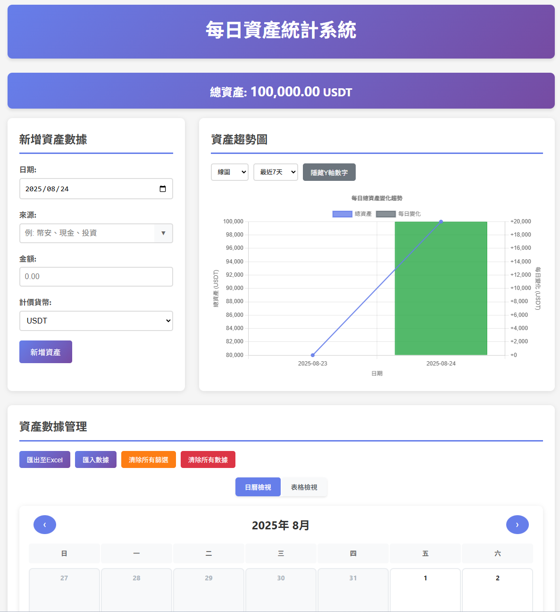

# 每日資產統計系統 📊

一個專為資產追蹤設計的現代化Web應用程式，支援多種資產來源記錄、圖表視覺化分析和數據管理功能。


## ✨ 功能特色

### 🎯 核心功能
- **多元資產記錄**：支援各種投資來源和計價幣種
- **智能數據視覺化**：使用 Chart.js 實現動態圖表分析
- **完整數據管理**：包含新增、編輯、刪除、篩選功能
- **Excel 整合**：一鍵匯出 CSV 格式，完美支援 Excel
- **響應式設計**：完美適配手機、平板、桌面設備

### 📊 圖表分析
- **多種圖表類型**：線圖、長條圖、圓餅圖切換
- **靈活時間範圍**：7天/30天/90天/全部數據篩選
- **每日變化追蹤**：自動計算並顯示資產變化趨勢
- **Y軸控制**：可隱藏/顯示Y軸數字，專注於趨勢觀察
- **顏色編碼**：綠色代表獲利，紅色代表虧損

### 🗓️ 日曆檢視
- **直觀日曆介面**：月曆形式顯示每日資產狀況
- **獲利虧損色彩標示**：一目了然的視覺回饋
- **詳細日資訊**：點擊日期查看當日完整資產明細
- **月份導航**：輕鬆瀏覽不同月份的資產記錄

### 🔍 進階篩選
- **Excel 風格篩選器**：專業級的多條件篩選功能
- **日期範圍選擇**：彈性的時間區間篩選
- **來源分類管理**：智能記憶歷史輸入來源
- **金額範圍篩選**：精確的數值區間查詢
- **排序功能**：支援各欄位升降序排列

### 💾 數據管理
- **本地儲存**：使用 localStorage 安全存儲在瀏覽器
- **數據備份**：JSON/CSV 格式匯入匯出
- **批量操作**：支援大量數據的快速處理
- **數據完整性**：自動驗證確保數據品質

## 🚀 快速開始

### 線上體驗
直接在瀏覽器中開啟 `index.html` 即可開始使用！

### 本地部署
```bash
# 克隆專案
git clone https://github.com/your-username/daily-portfolio.git

# 進入專案目錄
cd daily-portfolio

# 直接在瀏覽器中開啟
open index.html
# 或使用 Live Server 等工具
```

## 📖 使用指南

### 1. 新增資產數據
1. 選擇記錄日期
2. 輸入資產來源（系統會記住常用來源）
3. 填入資產金額
4. 選擇計價幣種（預設 USDT）
5. 點擊「新增資產」完成記錄

### 2. 查看分析圖表
- **圖表類型切換**：在下拉選單選擇線圖、長條圖或圓餅圖
- **時間範圍調整**：選擇要分析的時間區間
- **Y軸控制**：使用「隱藏Y軸數字」按鈕簡化圖表顯示
- **獲利虧損分析**：圖表自動標示每日變化

### 3. 日曆檢視操作
- **月份切換**：使用左右箭頭瀏覽不同月份
- **獲利虧損識別**：綠色表示獲利日，紅色表示虧損日
- **詳細資訊**：點擊有數據的日期查看詳細內容
- **快速編輯**：在日詳情彈窗中直接編輯或刪除記錄

### 4. 數據篩選與排序
- **Excel風格篩選**：點擊欄位標題旁的篩選按鈕
- **多條件組合**：同時使用多個篩選條件
- **快速排序**：點擊欄位標題進行排序
- **清除篩選**：一鍵重置所有篩選條件

### 5. 數據管理
- **匯出備份**：點擊「匯出至Excel」下載 CSV 檔案
- **匯入數據**：選擇 JSON 檔案批量匯入數據
- **數據清理**：使用清除功能重置系統

## 🛠️ 技術架構

### 前端技術棧
- **HTML5**：語意化結構設計
- **CSS3**：現代化響應式樣式，支援 Grid 和 Flexbox
- **JavaScript ES6+**：模組化物件導向設計
- **Chart.js**：專業圖表視覺化庫

### 特色技術實現
- **響應式設計**：Mobile-first 設計理念
- **本地存储**：localStorage API 數據持久化
- **模組化架構**：AssetTracker 類別封裝核心邏輯
- **事件驅動**：完整的用戶互動事件處理
- **數據驗證**：前端表單驗證和數據完整性檢查

## 📱 支援裝置

### 桌面端
- **Chrome 60+** ✅
- **Firefox 60+** ✅  
- **Safari 12+** ✅
- **Edge 79+** ✅

### 行動端
- **iOS Safari 12+** ✅
- **Android Chrome 60+** ✅
- **其他現代瀏覽器** ✅

## 📂 專案結構

```
daily-portfolio/
├── index.html          # 主頁面結構
├── styles.css          # 完整樣式表
├── script.js           # 核心業務邏輯
└── README.md           # 專案說明文件
```

## 🎨 介面預覽



### 桌面版
- 雙欄式佈局：輸入區 + 圖表區
- 完整功能面板
- 大尺寸圖表顯示

### 手機版  
- 單欄響應式佈局
- 觸控友好的操作介面
- 優化的圖表尺寸

### 主要特色
- **現代化 UI**：漂亮的漸層色彩和陰影效果
- **直覺操作**：符合用戶習慣的交互設計
- **視覺回饋**：即時的操作反饋和狀態提示
- **無障礙設計**：考慮各種用戶需求的包容性設計

## 🔧 自訂設定

### 支援的計價幣種
- USDT（預設）
- USDC  
- USD
- BUSD
- TWD

### 圖表自訂選項
- 線圖：趨勢分析最佳選擇
- 長條圖：期間比較清晰呈現  
- 圓餅圖：資產配置比例分析

## 🤝 貢獻指南

歡迎提交 Issue 或 Pull Request！

### 開發環境設定
1. Fork 此專案
2. 建立功能分支：`git checkout -b feature/amazing-feature`
3. 提交變更：`git commit -m 'Add amazing feature'`
4. 推送分支：`git push origin feature/amazing-feature`
5. 開啟 Pull Request


⭐ 如果這個專案對你有幫助，請給它一顆星星！

**讓理財變得更簡單，讓數據說話！** 📈